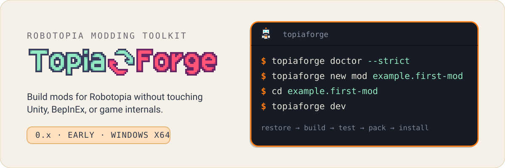
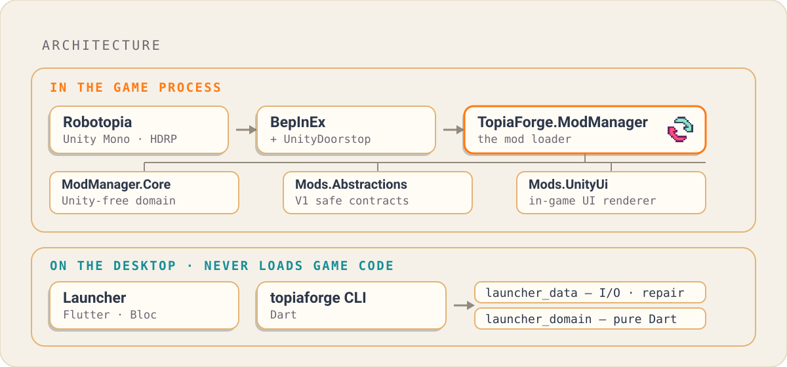

<p align="center">
  <picture>
    <source media="(prefers-color-scheme: dark)" srcset="./assets/readme/hero-dark.svg">
    
  </picture>
</p>

<p align="center">
  <a href="LICENSE"></a>
  <a href="https://github.com/Furroxide/TopiaForge/actions/workflows/ci.yml"></a>
  <a href="docs/"></a>
  
</p>

**TopiaForge is a modding toolkit for [Robotopia](https://builds.tomatocake.dev).** Players get a
desktop launcher that finds the game, repairs it, and installs mods. Authors get a typed C# SDK, a
developer CLI, and an in-game UI kit — with no dependency on Unity, BepInEx, or Robotopia internals.

Mods compile only against reference packages that TopiaForge ships. You never touch an engine type,
a reflection handle, or a game assembly, so a Robotopia update breaks far less than a hand-patched
mod would.

---

## For players

You need **no developer tools** — no Flutter, Dart, .NET, or Node.

1. Download the archive and `SHA256SUMS` from [Releases](https://github.com/Furroxide/TopiaForge/releases).
2. Check the archive against `SHA256SUMS`, then extract it with its layout intact.
3. Run `topiaforge doctor --strict`, then start the launcher.

The launcher detects your Robotopia installation, repairs the runtime payload, and lets you browse,
install, enable, disable, and launch mods. Profiles, dependency previews, and diagnostic bundles are
built in. The **Developer** tab is hidden unless you turn it on under **Settings → Developer mode**.

In game, open the manager from the main-menu **TopiaForge** button or press `F10`.

> [!IMPORTANT]
> The current candidate ships a **Windows x64 archive only.** Linux is held for a later 0.x release
> because Proton acceptance could not be validated on the release host, and macOS additionally
> requires Developer ID signing and notarization. Both remain supported in source.

Launcher updates are signed with Ed25519, verified before parsing, applied only after explicit
confirmation, and rolled back automatically if the startup health handshake fails — see
[launcher updates](docs/LauncherUpdates.md).

## Build your first mod

Robotopia build 2409 ships **Robotopia Creator**, its own browser world editor, so the split is
worth knowing before you start: the Creator owns what is *in* a world — scene layout, personalities,
publishing — and TopiaForge owns what a world *does* — C# behaviour, gamemodes, runtime control, and
local/CI tooling. [docs/CreatorScope.md](docs/CreatorScope.md) draws the line in full.

Only the pinned .NET SDK is required. Unity is optional, and only to author custom-geometry worlds.

```sh
topiaforge doctor --strict
topiaforge new mod example.first-mod --name "First Mod" --author "You" --license AGPL-3.0-or-later
cd example.first-mod
topiaforge dev
```

`topiaforge dev` restores, builds, tests, packs, validates, and installs the mod in one pass, then
tails the log in an interactive terminal. The full walkthrough is
[docs/YourFirstMod.md](docs/YourFirstMod.md).

Every service you need hangs off one owner-scoped context, so there is no owner id to pass and no
global cleanup to remember:

```csharp
using TopiaForge.Mods;

public sealed class FirstMod : TopiaForgeMod
{
    protected override void OnLoad()
    {
        Context.Logger.Info($"{Context.Identity.Name} {Context.Identity.Version} loaded.");
        Context.Ui.ShowToast("First Mod is running.");
    }
}
```

See [docs/CoreServices.md](docs/CoreServices.md) for all 24 services and
[docs/Modding.md](docs/Modding.md) for the full reference.

## How it fits together

<p align="center">
  <picture>
    <source media="(prefers-color-scheme: dark)" srcset="./assets/readme/architecture-dark.svg">
    
  </picture>
</p>

Two sides, one boundary. **In the game process**, BepInEx loads `TopiaForge.ModManager`, which owns
the loader payload and hands each mod a safe, owner-scoped context. **On the desktop**, the launcher
and the CLI share the same Dart domain and data layers and never load game code — so packaging,
dependency planning, and repair logic exist once, not twice.

The release-facing component and contract map is
[docs/ArchitectureInventory.md](docs/ArchitectureInventory.md).

## What's in the box

| Component | What it does |
| --- | --- |
| **Mod loader** | BepInEx plugin that discovers, orders, and runs `.topiaforgemod` packages, with an in-game manager on `F10`. |
| **Typed C# SDK** | 24 owner-scoped services on `IModContext`. No Unity types, no game internals, no reflection handles. |
| **Desktop launcher** | Detects and repairs the install, manages profiles, previews dependency and conflict plans, launches the game. |
| **`topiaforge` CLI** | 27 commands covering scaffold, restore, build, test, pack, validate, install, and release. |
| **In-game UI kit** | Declarative `UiNode` trees rendered by TopiaForgeUi — HUDs, windows, modals, toasts, with accessibility built in. See [docs/UiKit.md](docs/UiKit.md). |
| **7 mod templates** | `minimal`, `gameplay`, `gamemode`, `service`, `ui`, `asset`, `world` — each scaffolded, built, packed, and validated in CI. |
| **14 first-party mods** | Working reference implementations, from physics toys to a wave-survival showcase. See [docs/FirstPartyMods.md](docs/FirstPartyMods.md). |
| **Build-time analyzers** | Roslyn diagnostics that fail the build on direct Unity, GameCode, or Harmony use, wrong target framework, or undeclared capabilities. |
| **Optional modules** | RobotKit, Worlds, Chronos, Creator Content, Prompts, and Multiplayer, added atomically with `topiaforge mod add`. See [docs/Modules.md](docs/Modules.md). |

Authoring content instead of code? The launcher's Developer tab is a Creator-Companion-style cockpit
for Unity projects, VPM packages, and template scaffolding —
see [docs/CreatorCompanion.md](docs/CreatorCompanion.md).

## Status

TopiaForge is in early **0.x** development and has not had a stable release.

| | |
| --- | --- |
| Current candidate | `v0.1.0-rc.1` — prerelease, release readiness **blocked** |
| Platforms | Windows x64 only in this candidate |
| Robotopia target | build `2409` (canonical pin: [`.github/robotopia-game-build.json`](.github/robotopia-game-build.json)) |
| Registry | First-party artifacts only; community submissions closed pending moderation policy |
| Multiplayer | API preview with loopback and deterministic multi-peer tests; no live transport yet |

A 0.x line makes no cross-minor compatibility promise and is not the recommended build for
unattended or long-lived installations. Open gates are tracked in
[docs/LaunchBlockers.md](docs/LaunchBlockers.md); the compatibility policy is
[docs/CompatibilityPolicy.md](docs/CompatibilityPolicy.md).

## Trust model

TopiaForge installs **trusted local packages**. C# mods execute code inside the Robotopia process,
so do not install a `.topiaforgemod` file unless you trust its source.

Manifest capabilities *disclose* potentially sensitive behavior to a player. They do not sandbox,
mediate, or grant it. See [docs/PrivacyAndCapabilities.md](docs/PrivacyAndCapabilities.md).

## Meet the team

<table>
  <tr>
    <td align="center" valign="top" width="50%">
      <a href="https://github.com/Furroxide"></a><br>
      <b><a href="https://github.com/Furroxide">Furroxide</a></b><br>
      <sub><b>Founder &amp; Technical Lead</b></sub><br>
      <sub>Sets the project's direction and builds the runtime, launcher, SDK, developer tooling, and release platform.</sub>
    </td>
    <td align="center" valign="top" width="50%">
      <a href="https://github.com/skavvy"></a><br>
      <b><a href="https://github.com/skavvy">skavvy</a></b><br>
      <sub><b>Quality &amp; Visual Assets Lead</b></sub><br>
      <sub>Holds the quality bar and shapes how TopiaForge looks and presents itself.</sub>
    </td>
  </tr>
</table>

## Contributing

Pull requests target `dev`, use Conventional Commits titles, and need a
[DCO 1.1](DCO) sign-off (`git commit --signoff`). Start with
[CONTRIBUTING.md](CONTRIBUTING.md) and [docs/ContributorSetup.md](docs/ContributorSetup.md), which
covers prerequisites, the pinned SDKs, and the full verification suite.

```powershell
pwsh ./tools/bootstrap-dev.ps1 -Verify
```

Also relevant: [SECURITY.md](SECURITY.md) · [SUPPORT.md](SUPPORT.md) ·
[CODE_OF_CONDUCT.md](CODE_OF_CONDUCT.md)

## License

TopiaForge is free software under the [GNU Affero General Public License](LICENSE), version 3 or
later (`AGPL-3.0-or-later`), `Copyright (C) 2026 furroxide`.

The SDK packages carry the same terms **with no linking exception**, so a mod distributed against
the TopiaForge SDK must also be licensed `AGPL-3.0-or-later`. Third-party materials keep their
original licenses; see [THIRD_PARTY_NOTICES.md](THIRD_PARTY_NOTICES.md).

## Trademarks and affiliation

TopiaForge is an independent, community-built modding toolkit. It is not developed, published, or
endorsed by Tomato Cake or the Robotopia development team, and is not otherwise affiliated with
them. "Robotopia" and "Tomato Cake" are the property of their respective owners and are used here
only to identify the game this toolkit works with.
